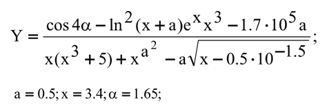

# Introduction to Python programming

## Tasks
* First task

    Calculate the area of a triangle with three corresponding sides
to your option.

    14 - 18 - 22

* Second task

    Calculate the arithmetic expression with the values corresponding to
own version

    

## Results
Console screenshots in the folder 
