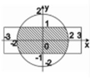
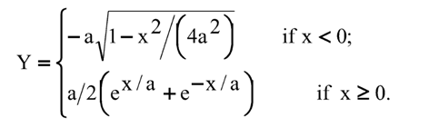

# Introduction to Python language instructions

## Tasks
* First task

    Write a program that asks the user to enter coordinates
and determine whether they belong to the shaded area.
    
    

* Second task
    
    Write a program that asks the user to enter the variables x and a.
Calculate the value of the Y expression using the if statement.
    
    

    
* Third task
    
    You have a list of N+10 numbers. Set the last element to the first place (at the front of the list) and vice versa.

* Fourth task

    Swap the N word and the 20-N word in the sentence (N = 5):

    "A programmer is a programming specialist who designs software (in simpler cases, individual programs) for 
     programmable devices that typically contain one or more processors."

* Fifth task

    Calculate the factorial for a positive number n=(N+5).
    
    *Note. The factorial of a natural integer n is the product of all natural numbers less than or equal to n.*

## Results
Console screenshots in the folders
