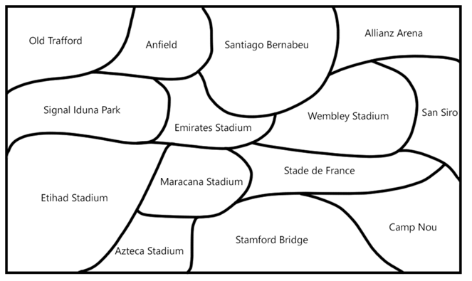

# Heuristic search using the Python language

## Task
* It shows several named areas. It is necessary to color these areas using four colors so that the color of any area 
does not coincide with the color of any of the areas adjacent to it.

    

* Make your own drawing, which shows several areas marked with names according to the subject area of your option. 
The number of names also depends on the option. Also use four colors. Develop a program for coloring areas

* My picture:

    

## Results
Console screenshots in the folder
